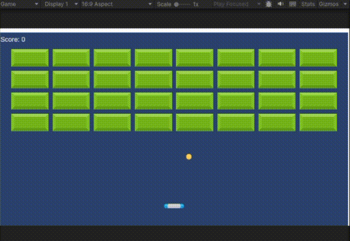

# MiniBreakout
🧱
A simple 2D Breakout-style game made with Unity.  
Move the paddle, bounce the ball, break all blocks, and clear the stage.

## Features

- Paddle movement with left and right arrow keys
- Ball movement using Rigidbody2D
- Bounce behavior with Physics Material 2D
- Paddle hit position affects the ball direction
- Automatic block placement with Prefabs
- Score system
- Game over and clear states
- Restart with the R key

## Controls

| Key | Action |
|---|---|
| Left Arrow | Move Left |
| Right Arrow | Move Right |
| R | Restart after game over or clear |

## Built With

- Unity
- C#
- Unity 2D Physics
- TextMeshPro

## What I Learned

- How Rigidbody2D and Collider2D work together
- How to use Physics Material 2D for bounce behavior
- How to create blocks with Prefabs and Instantiate
- How to manage game states with a GameManager
- How to display score and result text with UI
- How to separate gameplay logic from visual assets
